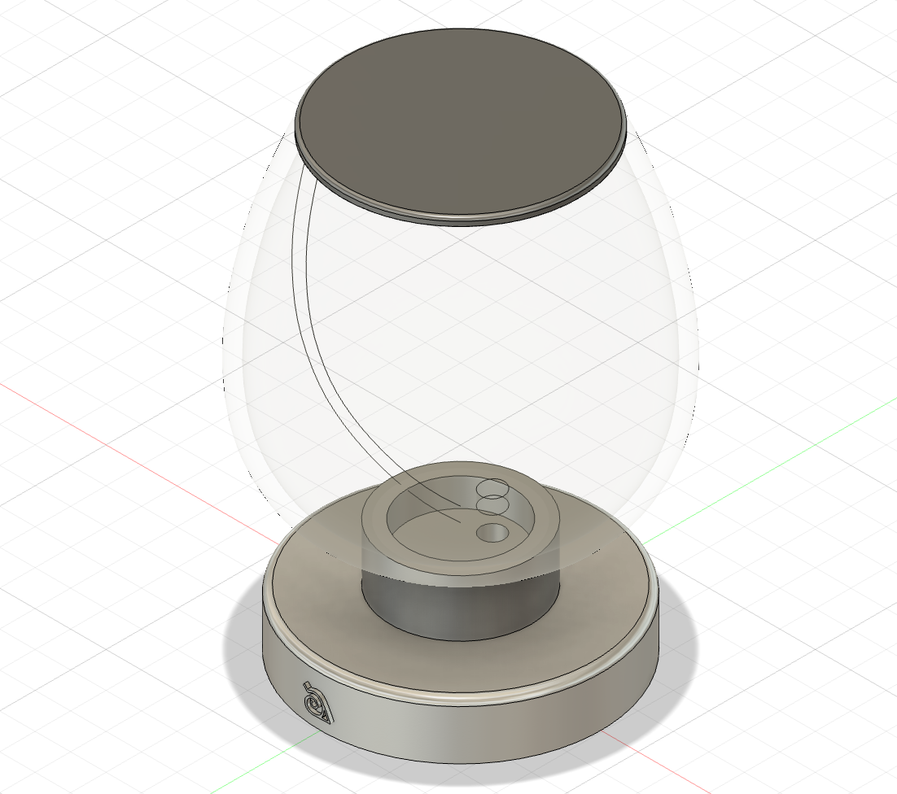
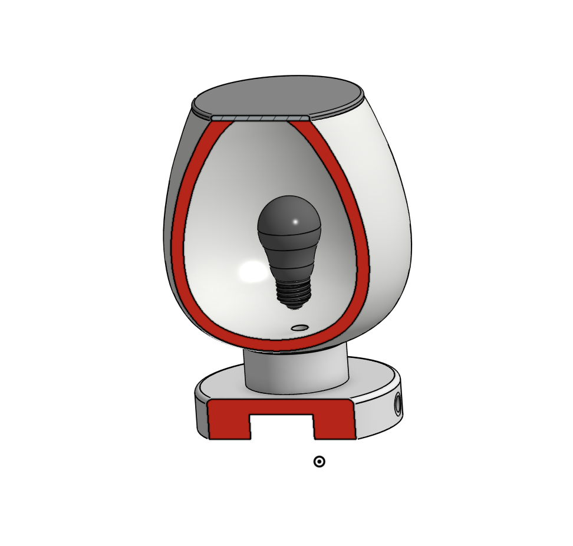
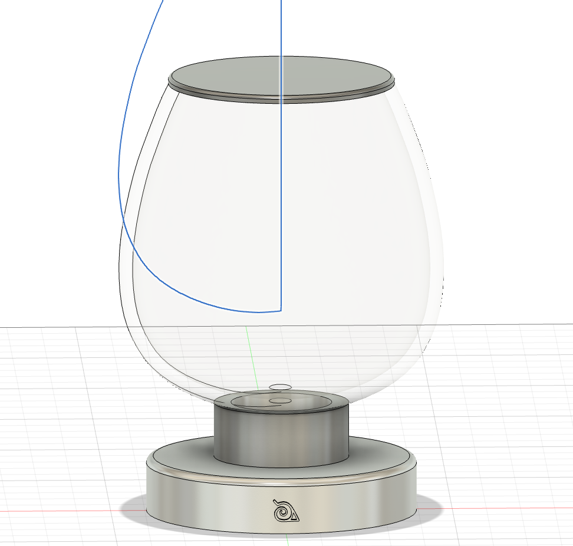
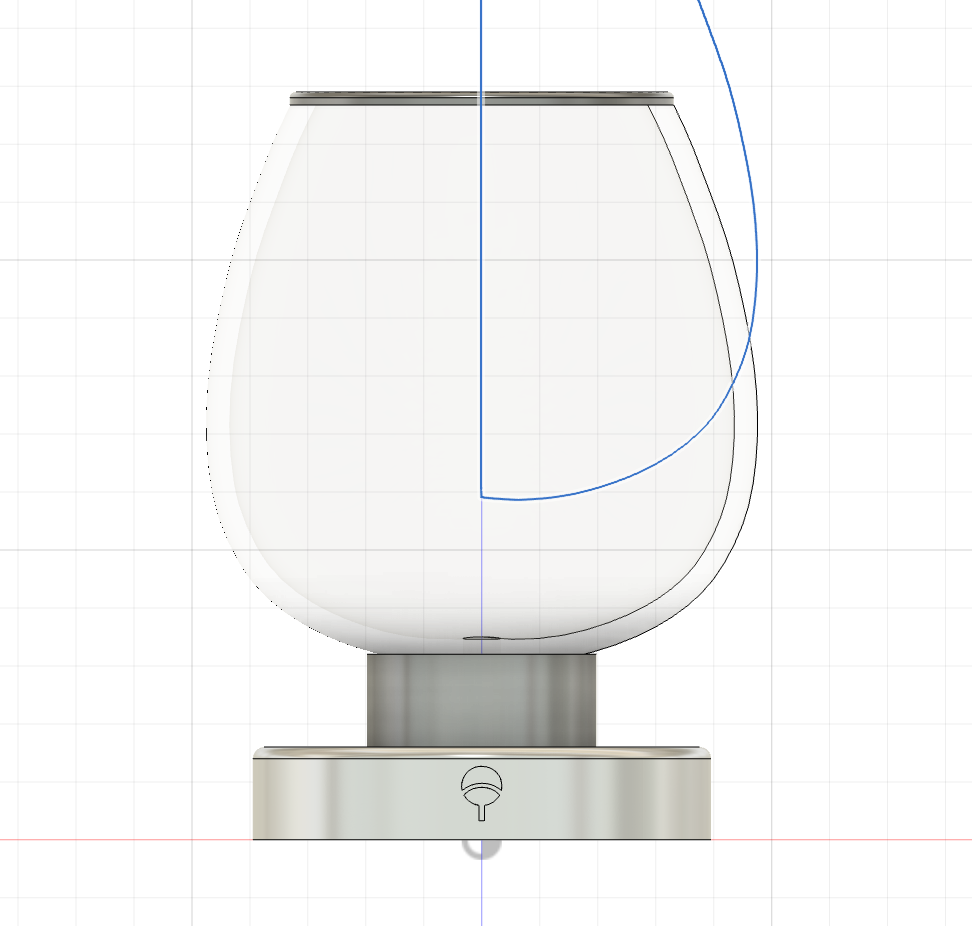
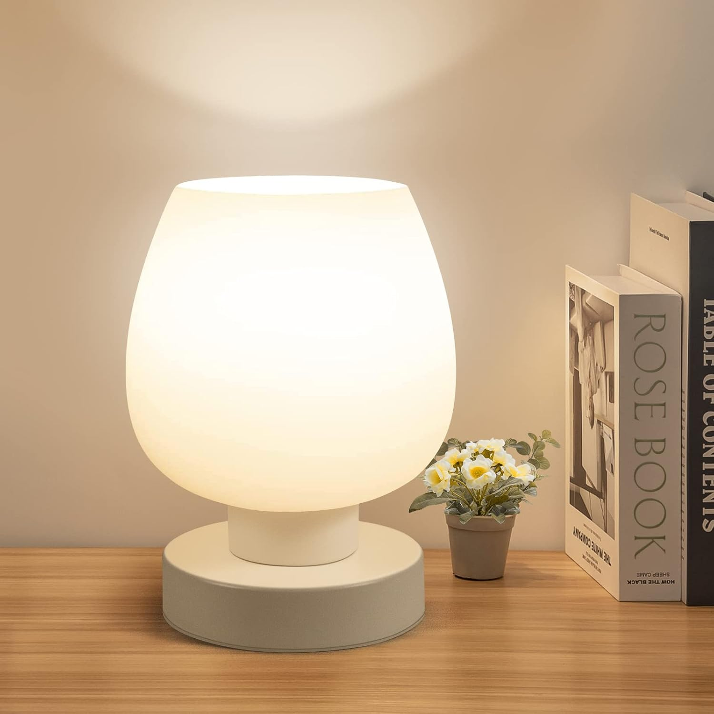

# cool naruto lamp that looks like a fishbowl

I originally designed it to be like a minimalistic lamp, but I just added random naruto symbols on it cause i thought it looked cool.

# FEATURES

- Has cool naruto symbols on it
- Lights up like any lamp
- Looks like a fishbowl and can probably hold fish
- nice glossy finish

## [BOM](https://github.com/aidenjcheng/cool-lamp/blob/main/BOM.csv)

| Name                                                                                                   | Quantity | Price   | Link                                                                                                                                                                                                                                                                                                                                                                                                                                                                                                                                                                                           | Notes                                                                           |
| ------------------------------------------------------------------------------------------------------ | -------- | ------- | ---------------------------------------------------------------------------------------------------------------------------------------------------------------------------------------------------------------------------------------------------------------------------------------------------------------------------------------------------------------------------------------------------------------------------------------------------------------------------------------------------------------------------------------------------------------------------------------------- | ------------------------------------------------------------------------------- |
| Hexagon Nut JIS B 1181 - M5 - C Steel 6 Plain and Hex Head Bolt JIS B 1180 - M5x20 - C Steel 4.6 Plain | 1        | ~$2.00  | —                                                                                                                                                                                                                                                                                                                                                                                                                                                                                                                                                                                              | probably have some lying around somewhere/i'll just pick some up from the store |
| Cable                                                                                                  | —        | $9.00   | https://www.amazon.com/Globe-Electric-Extension-Polarized-22816/dp/B075RH52LW/ref=sr_1_3?crid=2BZNO4GD7098R&dib=eyJ2IjoiMSJ9.ENkLZv9IsSD-Sb41hIgbozU1um9nYFfjJ_Ksvsd9_dcQRwe1EcmUqdj8t_g7fPDDCvyB-Ex836M-xajjUZ-VLsTQE4TME4Zw_jKVc6OmIhvxT_9JYvWhOVFHGR00vR3KC1C6BUSQCmtoqpbOQfrkBUvE5Py6Q-udR5WTQz4waBcV6NTyLBKZcircbhyZUj-x2NqrV983w5RvsP1ckTBNcXWmA_XblsTFwXSTk2ZJ4W-KIwYNR9n7v9PcQ4PAya-K7kVUCoDQm_Hqdo7ODR4vvPsWjJwcLOYKb1K__sZ779c.BNshDDbsBCOg01Pi_F0Ojynl4SbeNo8ECVLV4hbLHj0&dib_tag=se&keywords=fabric%2Bextension%2Bcord&qid=1764180148&sprefix=fabric%2Bext%2Caps%2C277&sr=8-3&th=1 | includes shipping                                                               |
| Light socket                                                                                           | —        | $4.99   | https://www.amazon.com/Leviton-49875-B01-09875-000-Incandescent-Fluorescent/dp/B000HJBCGU                                                                                                                                                                                                                                                                                                                                                                                                                                                                                                      | —                                                                               |
| **Total**                                                                                              | —        | **$14** | —                                                                                                                                                                                                                                                                                                                                                                                                                                                                                                                                                                                              | —                                                                               |

## symbolism

using surface level analysis of naruto series i metaphorically extruded the HLV symbol while dug the uchiha crest symbol into lamp (itachi worked in the shadows for the village-> indented vs extuded).

## RENDERINGS!!!!

## INSPIRATION

USED [JOHN HOPKINS](https://github.com/Learning-howto-Code/Minimalist-lamp) GITHUB'S README FOR REFERENCE
