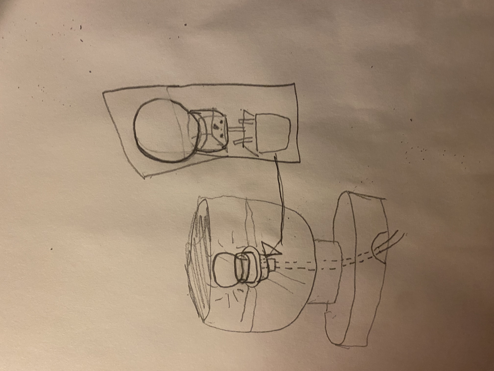
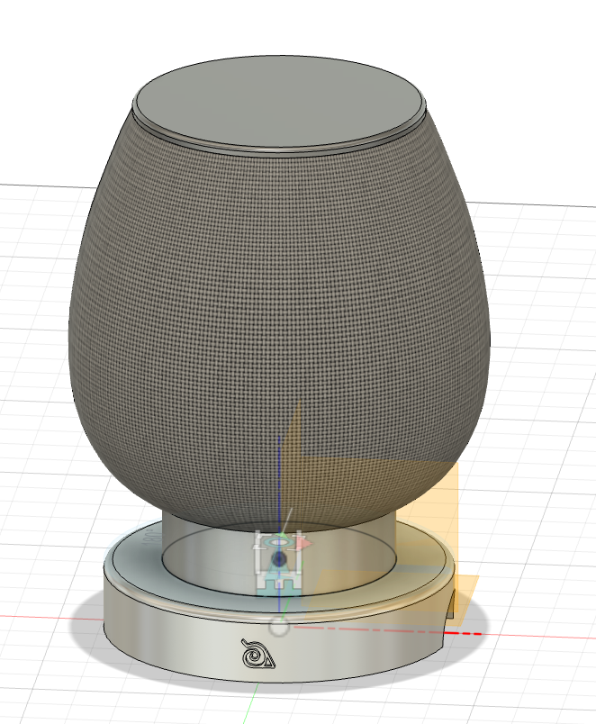
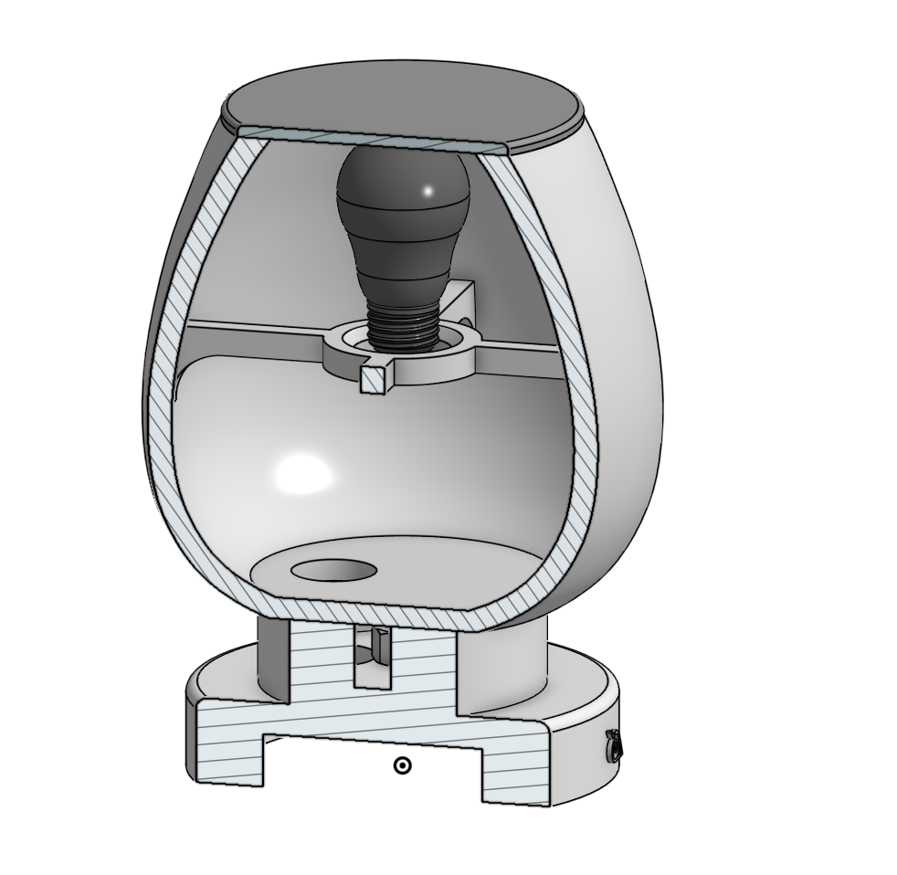
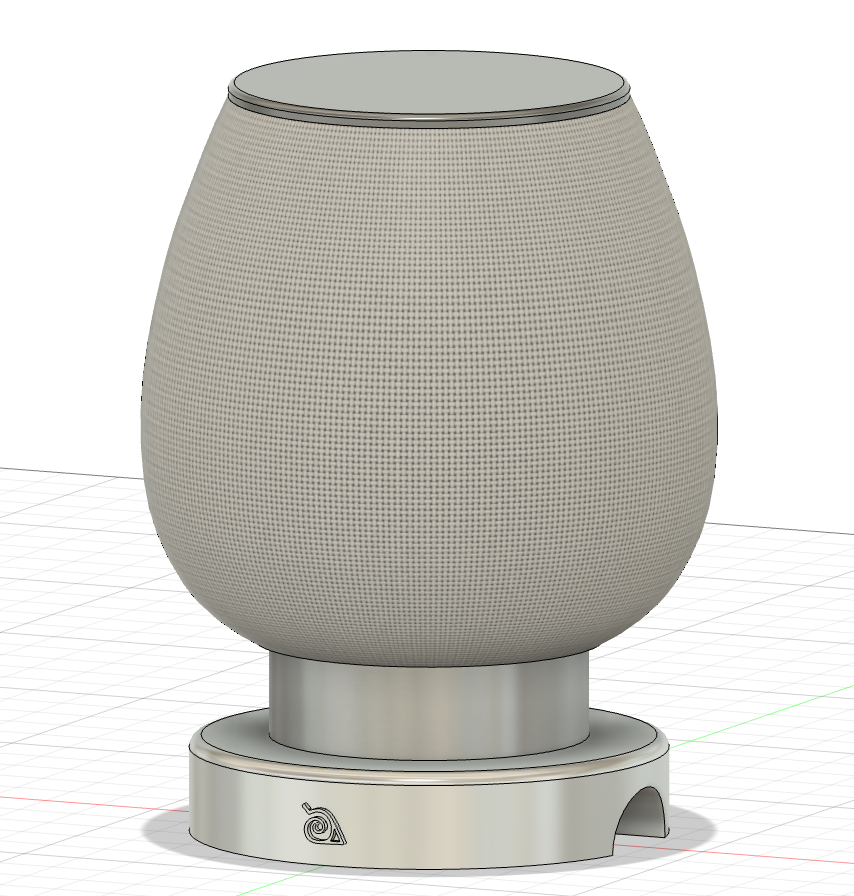
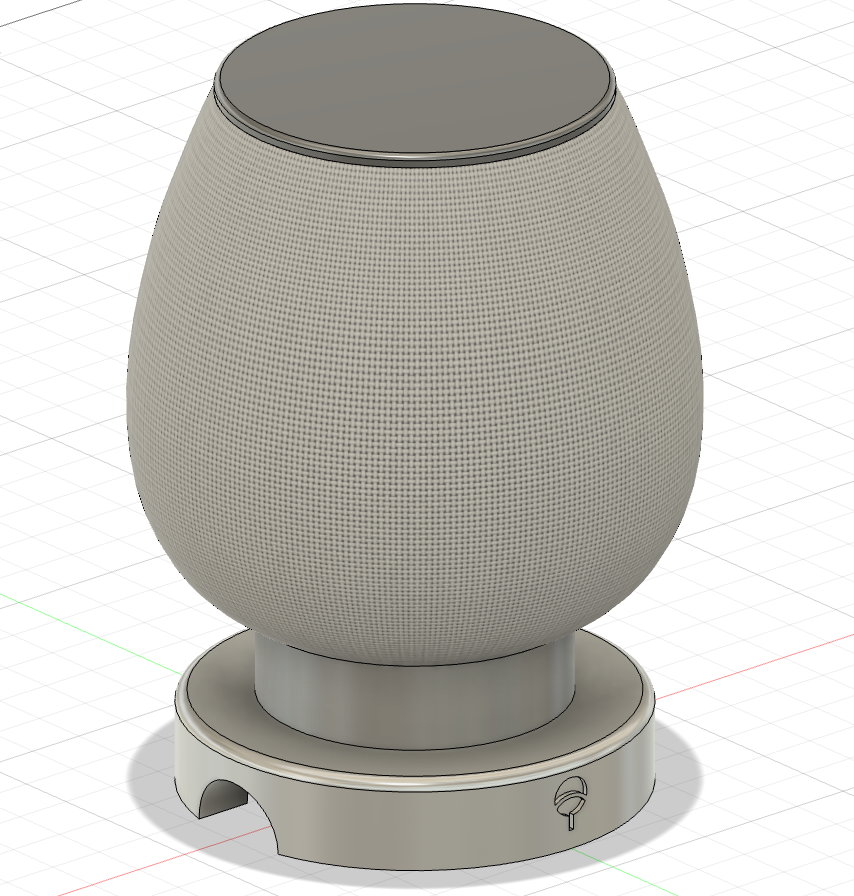

# cool naruto lamp that looks like a fishbowl

I originally designed it to be like a minimalistic lamp, but I just added random naruto symbols on it cause i thought it looked cool.

## FEATURES

- Has cool naruto symbols on it
- Lights up like any lamp
- Looks like a fishbowl and can probably hold fish
- nice glossy finish

## [BOM](https://github.com/aidenjcheng/cool-lamp/blob/main/BOM.csv)

| Name                                                                                                    | Quantity | Price                       | Link                                                                                                       | Notes                                                            |
| ------------------------------------------------------------------------------------------------------- | -------- | --------------------------- | ---------------------------------------------------------------------------------------------------------- | ---------------------------------------------------------------- |
| Hexagon Nut JIS B 1181 - M10 - C Steel 6 Plain and Hex Head Bolt JIS B 1180 - M5x32 - C Steel 4.6 Plain | 1        | -                           | —                                                                                                          | I have some lying around somewhere, from previous furniture sets |
| Cable                                                                                                   | 1        | $9.00                       | https://www.amazon.com/gp/product/B0CJ2PXRWL?smid=A7FCVZTAJCQ4N&psc=1                                      | I have prime so no shipping cost                                 |
| Light socket                                                                                            | 1        | $3.28                       | https://www.homedepot.com/p/Leviton-Outlet-to-Socket-Light-Plug-White-61-W-R52-00061-00W/100170446#overlay | will pickup since delivery cost money                            |
| **Total**                                                                                               | —        | **$13.02 (with sales tax)** | —                                                                                                          | —                                                                |

## implementation

I'm going to stick the cable up the lamp into the light socket.

## symbolism

using surface level analysis of naruto series i metaphorically extruded the HLV symbol while dug the uchiha crest symbol into lamp (itachi worked in the shadows for the village -> indented vs extuded).

## RENDERINGS!!!!

## INSPIRATION

USED [JOHN HOPKINS](https://github.com/Learning-howto-Code/Minimalist-lamp) GITHUB'S README FOR REFERENCE
